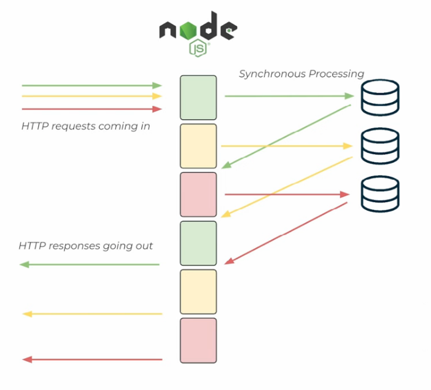

# Performance diagnostics in JS

## What's ahead?
- How Node.js works
- Why performance goes bad
- Diagnosing!
- Perf improving principles

## What's special about Node.js ?

It doesn't spawn threads for incoming requests

Consequences:

- Scales well on one process
- Offloads I/O to a pool of threads
  - Yes, there's threads, all 5 of them or so
- Asynchronous event loop model
  - Requests share memory and scope

### Event loop

```
   ┌───────────────────────────┐
┌─>│           timers          │
│  └─────────────┬─────────────┘
│  ┌─────────────┴─────────────┐
│  │     pending callbacks     │ ---- Your regular code runs here
│  └─────────────┬─────────────┘
│  ┌─────────────┴─────────────┐
│  │       idle, prepare       │
│  └─────────────┬─────────────┘      ┌───────────────┐
│  ┌─────────────┴─────────────┐      │   incoming:   │
│  │           poll            │<─────┤  connections, │
│  └─────────────┬─────────────┘      │   data, etc.  │
│  ┌─────────────┴─────────────┐      └───────────────┘
│  │           check           │
│  └─────────────┬─────────────┘
│  ┌─────────────┴─────────────┐
└──┤      close callbacks      │
   └───────────────────────────┘
```

----



#### Classic event loop talk

https://www.youtube.com/watch?v=8aGhZQkoFbQ

## Performance, or what it isn't

### Event loop blocked

Synchronous work going on means no other event loop functionallities work.  
Incoming connections will wait on the network layer to get handled.


#### Heavy work examples

- JSON parsing
- String processing/concatenation
- Cryptography/maths
- Checking if file exists (if failed) 🤔

#### Do not thrash the Node js event loop
https://www.youtube.com/watch?v=VI29mUA8n9w

### Excess promises/async

- queues get filled up
- async steps, wrapping/unwrapping promises takes time

### Memory issues and Garbage Collection

GC can take a lot of time if it has a lot to do!

- allocating lots of heavy short-lived objects puts pressure on GC


### Programmer errors

Mostly just unnecessary iteration or duplicating work

- in 2014 or 2015 folks at Netflix discovered that updating express endpoints in a working app without restarting actually adds them to the routes array which makes routing slower and effectively leaks memory.


## Diagnosing

### Finding event loop blocks

Detection:
 `blocked` or `loopbench` 

Measuring event loop utilization
`require('perf_hooks').performance.eventLoopUtilization`
https://nodesource.com/blog/event-loop-utilization-nodejs/

Finding the actual blocking code path:
`blocked-at` - it's an experiment of mine that needs refreshing 😅

#### CPU usage measurement

**flame graphs**
`0x` `clinic flame`  
or Linux builtin `perf` with https://nodejs.org/en/guides/diagnostics-flamegraph/ (might be outdated since I wrote it)

**devtools**
- Performance tab (recently simplified)

#### Other performance measurements

- trace opt/deopt
- V8 tracing overall
- the entire `perf_hooks`
- async hooks and promise hooks
- diagnostics channel

## Performance improving principles

### Caching and memoization

- You can keep results in memory instead of calculating them. Works wonders for inefficient recursive graph traversal implementations as well as simple request-response sequences

Memoization is when you don't invalidate any caches, they get garbage collected at the end of the function execution or are epected to be finite

Caching is when you manage the storage.

#### Cache invalidation

Famously a hard problem. Just make sure you think twice.

### Avoiding duplicate fetches

#### Wrong
```js
const cache = new Map();

function getUrl(url) {
    if (cache.has(url)){
        return cache.get(url)
    } else {
        return fetch(url).then(r=>r.json())
          .then(result => {
              cache.set(url, result);
              return result;
          });
    }
}

```

#### Right (disregard the memory leak)
```js
const cache = new Map();

function getUrl(url) {
    if (cache.has(url)){
        return cache.get(url)
    } else {
        const promiseToCache = fetch(url).then(r=>r.json());
        cache.set(url, promiseToCache);
        return promiseToCache;
    }
}

```
#### Avoiding duplicate fetches - tools

Use astual tools that have been benchmarked.
https://github.com/mcollina/async-cache-dedupe

### Optimization and Hidden Classes

- monomorphic
- polymorphic
- megamorphic

- deopt is when compiled JS needs to be thrown away because types don't match anymore.

**Avoid changing types of references and structures of objects**

### Fail fast

- return 503 so that load ballancer redirects traffic if you see you're overwhelmed

## Unexpected performance monsters

- config files lookup (especially if there's a tree traversal and checking for files all the time) - .babelrc for example
- some popular logging libraries are horribly slow by default

## Other material


### graphql specific stuff

2020 GraphQL - Accelerated! - Matteo Collina 
https://www.youtube.com/watch?v=CQ1KgfVcL2E

2018 GraphQL - Accelerated! - Matteo Collina & Mathias Buus
https://www.youtube.com/watch?v=-V86BB9wrG8

graphql talk and workshop from NodeConfEU
Intro talk:
https://www.youtube.com/watch?v=guAMBFqKSF4
Workshop:
https://github.com/nearform/the-graphql-workshop

### memory leaks etc

https://naugtur.pl/pres3/mem2020/2024.html