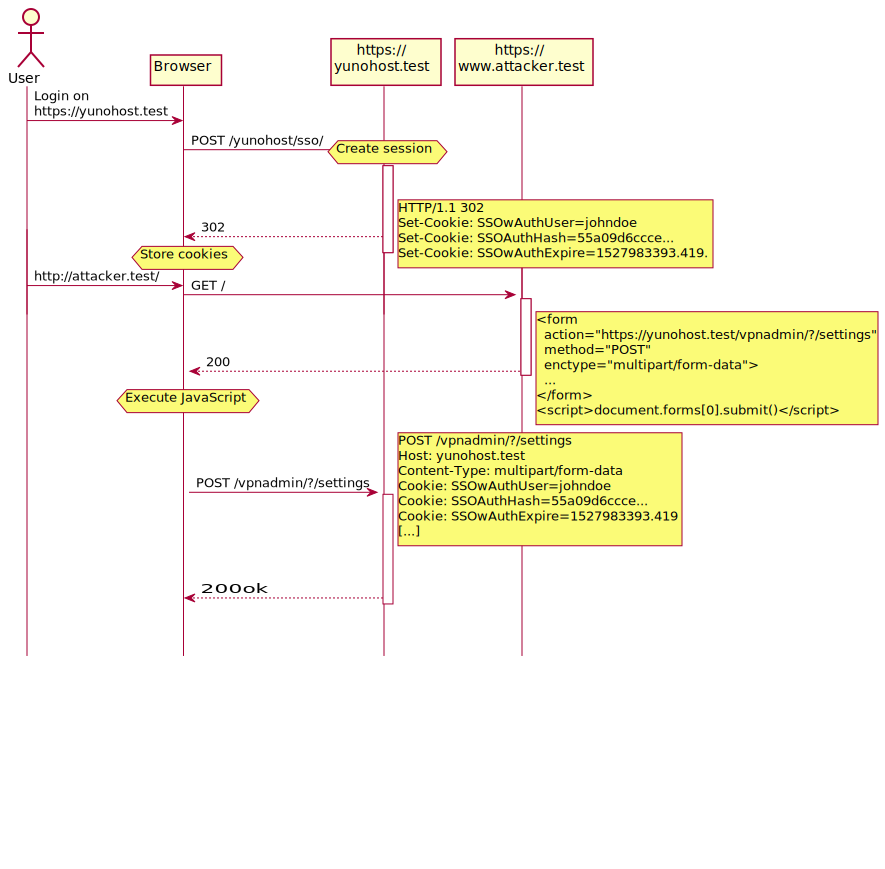
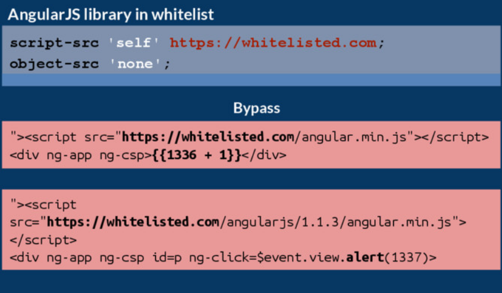
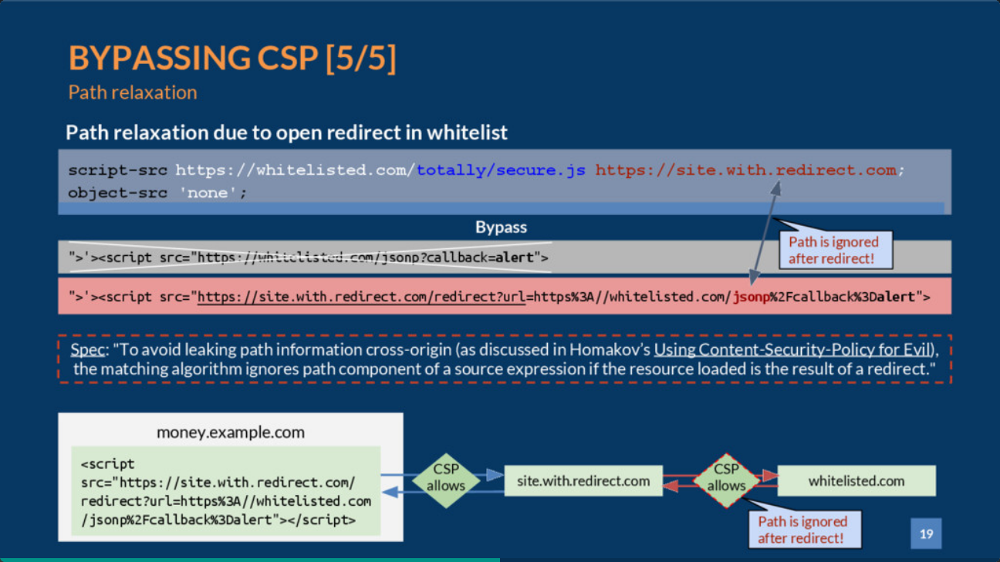

# Web Security and its rabbitholes


## Fundamentals

What is web security all about?

### SameOrigin policy
  - Origin
    - scheme+host+port
  - Realm
  - Window

#### FRC 6454
```
5.  Comparing Origins
   Two origins are "the same" if, and only if, they are identical.  In
   particular:

   o  If the two origins are scheme/host/port triples, the two origins
      are the same if, and only if, they have identical schemes, hosts,
      and ports.

   o  An origin that is a globally unique identifier cannot be the same
      as an origin that is a scheme/host/port triple.

   Two URIs are same-origin if their origins are the same.

      NOTE: A URI is not necessarily same-origin with itself.  For
      example, a data URI [RFC2397] is not same-origin with itself
      because data URIs do not use a server-based naming authority and
      therefore have globally unique identifiers as origins.
```
#### Deep dive: iframe & Realm

- same origin iframe
```
window.top.globalFunction();
window.top.location.reload();
```
- cross origin iframe
```
Uncaught DOMException: Permission denied to access property "reload" on cross-origin object
```

- identity discontinuity
```
window.top.Array.prototype !== window.Array.prototype
```

#### Deep dive: iframe sandbox

```
<iframe sandbox="" src="...">
```

- unique origin on the document
- unique origins on the resources (scripts) 

https://developer.mozilla.org/en-US/docs/Web/HTML/Element/iframe

---

The attribute values are used to **LOOSEN** the sandbox security

Engines have to do horrible things to prevent leaking information cross-origin.

May be surprising:
http://naugtur.pl/rejection-in-iframe-sandbox/

Enforcement is difficult and has lots of edge cases
https://bugs.chromium.org/p/chromium/issues/detail?id=103630

#### Deep dive: CORS

> CORS: when you need a SameOrigin Policy bypass for a feature

- history: using flash for cross-origin requests
- not a security mechanism
- simple requests - what HTML is capable of
- preflight for others

no-preflight requests are made anyway, just no reading the response

---
Headers

```
Access-Control-Allow-Origin: *
Access-Control-Allow-Origin: https://naugtur.pl
Access-Control-Allow-Origin: ${req.headers.origin}
```
```
Access-Control-Request-Method: POST
Access-Control-Request-Headers: Authorization, Content-Type

Access-Control-Allow-Origin: https://naugtur.pl
Access-Control-Allow-Methods: POST, GET, OPTIONS
Access-Control-Allow-Headers: Authorization, Content-Type
Access-Control-Max-Age: 7200
```
---
browsers have a cap on Access-Control-Max-Age

>Firefox caps this at 24 hours (86400 seconds). Chromium (prior to v76) caps at 10 minutes (600 seconds). Chromium (starting in v76) caps at 2 hours (7200 seconds). The default value is 5 seconds. 

 https://developer.mozilla.org/en-US/docs/Web/HTTP/Headers/Access-Control-Max-Age

### Cookies and sessions
  - attributes
  https://owasp.org/www-project-web-security-testing-guide/latest/4-Web_Application_Security_Testing/06-Session_Management_Testing/02-Testing_for_Cookies_Attributes
  
  - with HttpOnly - the only webapp storage inaccessible to XSS

#### Session
  - stateful or stateless?
    - cookie session vs JWT in the app
      - stealer malware
      - xss
    - session pinning (IP or https)
  - CSRF

#### Deep dive: CSRF

https://portswigger.net/web-security/csrf/lab-no-defenses

---

<!-- _class: -->



---
They say don't roll your own CSRF, but then again...
https://portswigger.net/daily-swig/csrf-flaw-in-csurf-npm-package-aimed-at-protecting-against-the-same-flaws
https://fortbridge.co.uk/research/a-csrf-vulnerability-in-the-popular-csurf-package/?trk=public_post_comment-text


- Double Submit Cookie Pattern is difficult to implement
- Snyk removed the post and warnings - only insecure when misused?

## XSS

- Reflected XSS - where the malicious script comes from the current HTTP request.
- Stored XSS - where the malicious script comes from the website's database.
- DOM-based XSS - where the vulnerability exists in client-side code rather than server-side code.

https://portswigger.net/web-security/cross-site-scripting

### Exercise


https://xss-game.appspot.com

```

```


#### spoilers

1' onerror=alert() a='
',alert(),'
next=javascript:alert()
data:@file/javascript;base64,YWxlcnQoKQo=

## CSP and how to roll out

- core knowledge
  https://content-security-policy.com/
  https://developer.mozilla.org/en-US/docs/Web/HTTP/CSP

### XSS CSP bypass



---



---

Whole deck
https://speakerdeck.com/lweichselbaum/csp-is-dead-long-live-strict-csp-deepsec-2016?slide=16

### Strict CSP

https://content-security-policy.com/strict-dynamic/

https://web.dev/strict-csp/


#### Allowing scripts
- Nonce-based CSP
- Hash-based CSP

### Exercise

https://github.com/naugtur/CSP-exercise

https://portswigger.net/web-security/cross-site-scripting/contexts/client-side-template-injection/lab-angular-sandbox-escape-and-csp

### Rollout

- careful with features

- careful with reporting sink
  https://github.com/naugtur/csp-report-lite

#### report-to vs report-uri

report-uri works.


report-to - only supported by chromium and doesn't seem to work.
- must be https, apparently
- Report-To header already deprecated and doesn't seem to work
- Reporting-Endpoints doesn't work either

DOH! https://bugs.chromium.org/p/chromium/issues/detail?id=1152867

- https://developer.mozilla.org/en-US/docs/Web/HTTP/Headers/Content-Security-Policy/report-to


#### trusted types

https://web.dev/trusted-types/

### More reading

https://david-gilbertson.medium.com/im-harvesting-credit-card-numbers-and-passwords-from-your-site-here-s-how-9a8cb347c5b5

https://portswigger.net/research/ambushed-by-angularjs-a-hidden-csp-bypass-in-piwik-pro

### MetaMask and CSP

https://github.com/MetaMask/detect-provider/issues/31

- TODO: try with a script hash

## Supply chain

- https://security.snyk.io/
- npm maudit etc.
- https://socket.dev
- LavaMoat